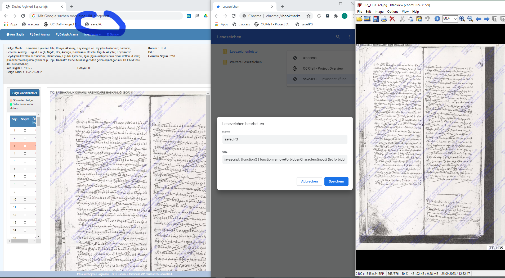

# base64bookmark

So, let’s assume you need to save a base64 encoded image that has been embedded into a website. That website may be using spans of a certain `id` attribute for referencing that image. You want to save the contents of the base64 stream as a JPG.

Time to create a JavaScript Bookmarklet (cf. https://www.freecodecamp.org/news/what-are-bookmarklets/) for that purpose.

## Usage

1. Import base64bookmark.html in your browser’s bookmark manager

2. Load the HTML page for each image
3. Click your bookmarklet to save the jpg, which has been loaded
4. Tested with Chrome (appends a sequential number to your downloaded jpgs) and Firefox
